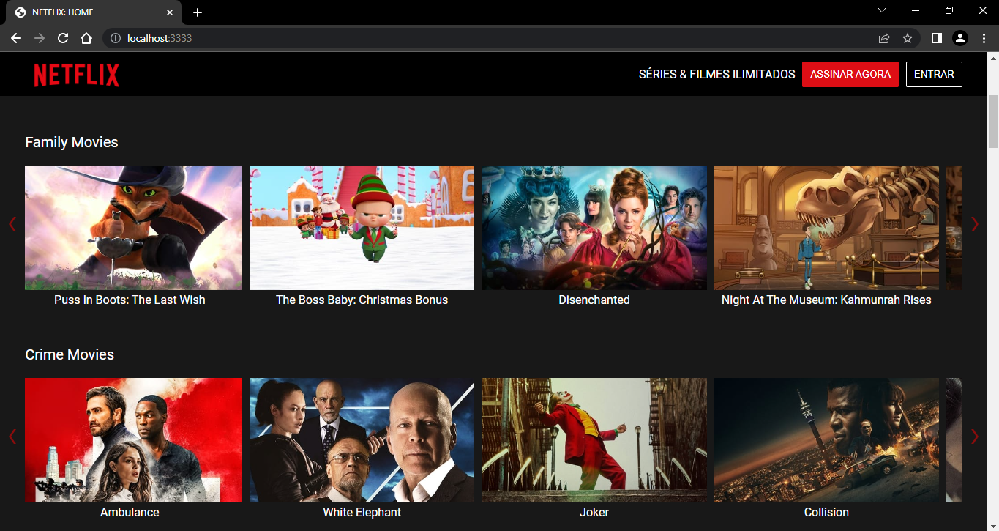

<h1 align="center">
  
</h1>

# CloneFlix

Pequeno projeto feito com a DIO de um clone da Netflix consumindo a API do moviedb.

## Funcionalidades

- Responsivo
- Posteres dos filmes
- Modo tela cheia
- Multiplataforma

## Aprendizados

- Construir um carrousel via JS
- Melhorando os conhecimentos de consumo de API'S

## Stack utilizada

**Front-end:** HTML, CSS e JavaScript puros

**Back-end:** Node, Express
